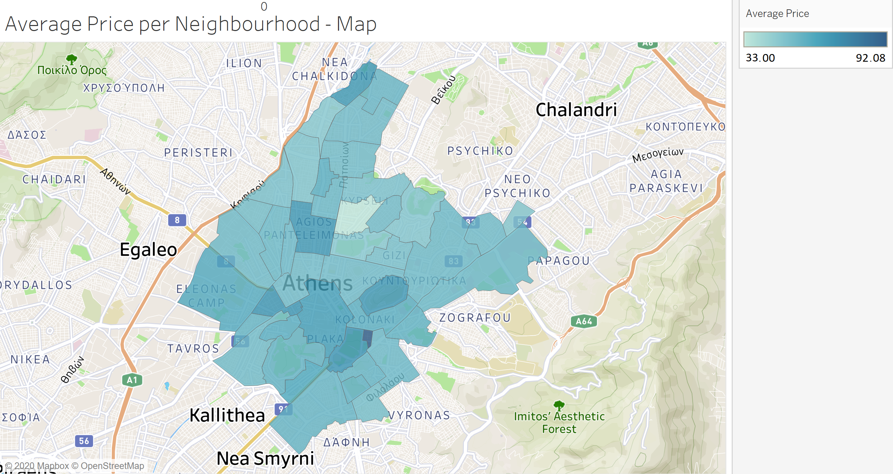

See html output at github:
```{r, echo = FALSE}
knitr::opts_chunk$set(
  fig.path = "README_figs/README-"
)
```

We load any necessary libraries:
```{r setup, include=FALSE}
knitr::opts_chunk$set(message = FALSE) #suppress the message
library(ggplot2)
library(dplyr)
library(stringr)
library(gcookbook)
```
First we load the data set:
```{r}
data <- read.csv("listings.csv")
data
```
Then we clean the data set and keep only the columns that we need:
```{r}
data = subset(data, select = -c(scrape_id,last_scraped,name,summary,space,description,experiences_offered,neighborhood_overview,notes,transit,access,interaction,house_rules,thumbnail_url,medium_url,picture_url,xl_picture_url,host_id,host_name,host_url,host_since,host_location,host_about,host_response_time,host_response_rate,host_acceptance_rate,host_is_superhost,host_thumbnail_url,host_picture_url,host_neighbourhood,host_listings_count,host_total_listings_count,host_verifications,host_has_profile_pic,host_identity_verified,street,neighbourhood_cleansed,neighbourhood_group_cleansed,city,state,zipcode,market,smart_location,country_code,country,is_location_exact,accommodates,square_feet,weekly_price,monthly_price,security_deposit,cleaning_fee,minimum_nights,maximum_nights,minimum_minimum_nights,maximum_minimum_nights,minimum_maximum_nights,maximum_maximum_nights,minimum_nights_avg_ntm,maximum_nights_avg_ntm,calendar_updated,has_availability,calendar_last_scraped,first_review,last_review,requires_license,license,jurisdiction_names,instant_bookable,is_business_travel_ready,cancellation_policy,require_guest_profile_picture,require_guest_phone_verification,calculated_host_listings_count,calculated_host_listings_count_entire_homes,calculated_host_listings_count_private_rooms,calculated_host_listings_count,calculated_host_listings_count_shared_rooms))
data
```
We omit the none values:
```{r}
data <- na.omit(data)
data$price = as.numeric(gsub("[\\$,]", "", data$price))
data
```
We export our data to a new csv file:
```{r}
write.csv(data,"listings_cleansed.csv", row.names = FALSE)
```
We summarise our data:
```{r}
summary(data)
```
From the above results we can see that "Plaka" and "Koukaki" neighbourhoods are very popular for airbnb in Athens, with a total of 1063 and 825 hosts respectively. We can also see that many hosts have a price of $35-60 per night.

We calculate the average price for our data set as follows:
```{r}
data$price = as.numeric(data$price)
avg_price = mean(data$price)
avg_price
```
Now we plot several graphs regarding price and neighbourhood. Firs we do some data calculations:
```{r}
data_avg <- data %>%
  group_by(neighbourhood) %>%
  summarise(avg_price_per_neighbourhood = mean(price)) %>%
  arrange(avg_price_per_neighbourhood)

# delete an empty string
data_avg <- data_avg[-29,]
data_avg
```

```{r}
data_avg$neighbourhood <- reorder(data_avg$neighbourhood, -data_avg$avg_price_per_neighbourhood)

ggplot(data_avg, aes(x = neighbourhood, y = avg_price_per_neighbourhood, colour = avg_price_per_neighbourhood)) + geom_point() + theme(axis.text.x = element_text(angle = 60, hjust = 1)) + ggtitle("Price Per Neighbourhood") + xlab("Neighbourhood") + ylab("Price per night")
```

```{r}
data_avg$neighbourhood <- reorder(data_avg$neighbourhood, -data_avg$avg_price_per_neighbourhood)

ggplot(data_avg, aes(x = neighbourhood, y = avg_price_per_neighbourhood, colour = avg_price_per_neighbourhood, avg_price_per_neighbourhood, ann = FALSE)) + geom_col(width = .825, position = "identity", colour = "black", size = 0.25, fill="steelblue") + geom_text(aes(label = round(avg_price_per_neighbourhood)), colour = "white", size = 3, vjust = 1.5, position = position_dodge(1)) + theme(axis.text.x = element_text(angle = 35, hjust = 1), panel.background = element_rect(fill = "white", size = 2, linetype = "solid"),) + ggtitle("Price Per Neighbourhood") + xlab("Neighbourhood") + ylab("Price per night")
```

Now we plot some graphs regarding price and availability for the whole year:
```{r}
ggplot(data, aes(x = availability_365)) + geom_bar(fill="steelblue") + theme_bw() + labs(x = "Annual Availability", y = "Accommodations") + ggtitle("Total number of annual available accommodations") 
```
```{r}
ggplot(data, aes(x = availability_365, y = ..count..,fill = room_type)) + geom_density(alpha = .3, color = 0) + theme_minimal() + labs(x = "Days", y = "Availability") + ggtitle("Annual availability per Room type")
```
```{r}
ggplot(data, aes(x = availability_365, y = ..count..,fill = neighbourhood)) + geom_density(alpha = .3, color = 0) + theme_minimal() + labs(x = "Days", y = "Availability") + ggtitle("Availability per Neighbourhood") + scale_fill_viridis_d(option="A")
```

```{r}
data2 <- data %>%
  filter(price <= 100) %>% 
  filter(availability_365 == 365)

ggplot(data2, aes(x = price , fill = neighbourhood)) + geom_bar() + labs(x = "Average price", y = "Accommodations") + theme_minimal() + ggtitle("Accommodations with price < 100 $")
```

Now we plot some graphs regarding price and review scores rating:
```{r}
ggplot(data, aes(x = review_scores_rating)) + geom_bar(fill="steelblue") + theme_minimal() + labs(x = "Review scores", y = "Reviews") + ggtitle("Total number of Reviews per review scores rating") 
``` 

We calculate the average price per review score and continue our analysis:
```{r}
data_avg2 <- data %>%
  group_by(review_scores_rating) %>%
  summarise(avg_price_per_review_score = mean(price)) %>%
  arrange(avg_price_per_review_score)

data_avg2
```

```{r}
ggplot(data_avg2 , aes(x = review_scores_rating, y = avg_price_per_review_score)) + geom_point(position = position_jitter(width = .3, height = .08),alpha = 0.4, shape = 21, size = 1.5, colour = "magenta") + geom_smooth(color = "black", size = 0.8, linetype = 2) + theme_bw() + labs(x = "Review score", y = "Average price") + ggtitle("Average price per review score") 
```
```{r}
ggplot(data_avg2 , aes(x = review_scores_rating, y = avg_price_per_review_score)) + geom_col(width = 1, position = "identity", colour = "black", fill="steelblue", size = 0.25) + labs(x = "Review score", y = "Average price") + ggtitle("Average price per review score") + theme_bw() 
```

```{r}
ggplot(data2, aes(x = review_scores_rating, y = price, colour = price)) + geom_point(position = position_jitter(width = .3, height = .08),alpha = 0.4, shape = 21, size = 1.5) + geom_smooth() + theme_bw() + labs(x = "Review score", y = "Average price") + ggtitle("Average price per review score")  
```
```{r}
# show only accommodations with price below or equal to 100
# we are not interested in expensive accommodations
datasc <- data %>%
  filter(price <= 100)

ggplot(datasc, aes(x = review_scores_rating, y = price, colour = price)) + geom_point(position = position_jitter(width = .3, height = .08),alpha = 0.4, shape = 21, size = 1.5) + stat_smooth(method = loess) + theme_bw() + labs(x = "Review score", y = "Average price") + ggtitle("Average price per review score") 
```

<br />

Now we plot some graphs regarding room type. We first calculate the mean price for each room type as follows:
```{r}
data_room <- data %>%
  group_by(room_type) %>%
  summarise(avg_price_per_room_type = mean(price)) %>%
  arrange(avg_price_per_room_type) 
data_room
# note that the very high average shared room price is due to some extremely high outliers
```
Now we plot our graphs:
```{r}
ggplot(data, aes(x = price, fill = room_type)) +
geom_density(alpha = .3, color = 0) + xlim(0, 100) + theme_minimal() + labs(x = "Price", y = "Density") + ggtitle("Price per Room type - Density curve (Probability)")
```
```{r}
ggplot(data, aes(x = price, y = ..count..,fill = room_type)) + geom_density(alpha = .3, color = 0) + theme_minimal() + labs(x = "Price", y = "Density") + xlim(0, 100) + ggtitle("Price per Room type - Density curve") + scale_fill_viridis_d()
```

```{r }
# we are not interested in prices higher than 100 USD per night
data_boxplot = data %>%
  filter(price <= 100)

ggplot(data_boxplot, aes(x = room_type, y = price)) + geom_boxplot(outlier.shape = NA) + geom_jitter(color = 'blue', alpha=0.05) + theme_minimal() + scale_x_discrete(limits = c("Hotel room", "Entire home/apt", "Private room", "Shared room")) + labs(x = "Room type", y = "Price") + ggtitle("Price per Room type - Boxplot")
```

```{r}
count_room_types = table(data$room_type)
x = round(count_room_types/sum(count_room_types)*100,digits=1)

pie_data = as.data.frame(x)

slices <- pie_data$Freq
lbls <- pie_data$Var1
lbls <- paste(lbls, slices)
lbls <- paste(lbls,"%",sep="")

pie(slices,labels = lbls, main="Share of room types")
```

<br />

Finally, we filter our data, in order to suggest some specific accommodations that fulfil our prerequisites. You can see the links of the accommodations that we suggest below:
```{r}
data_suggest <- data %>%
  filter(price <= 50) %>% 
  filter(availability_365 == 365) %>%
  filter(review_scores_rating >= 95) %>%
  filter(neighbourhood == 'Koukaki') %>%
  filter(room_type == 'Entire home/apt') %>%
  select(listing_url)

data_suggest
```


